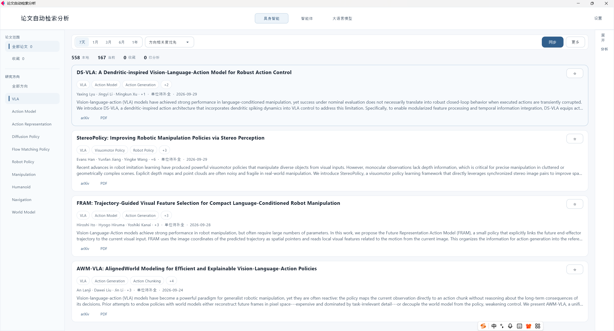
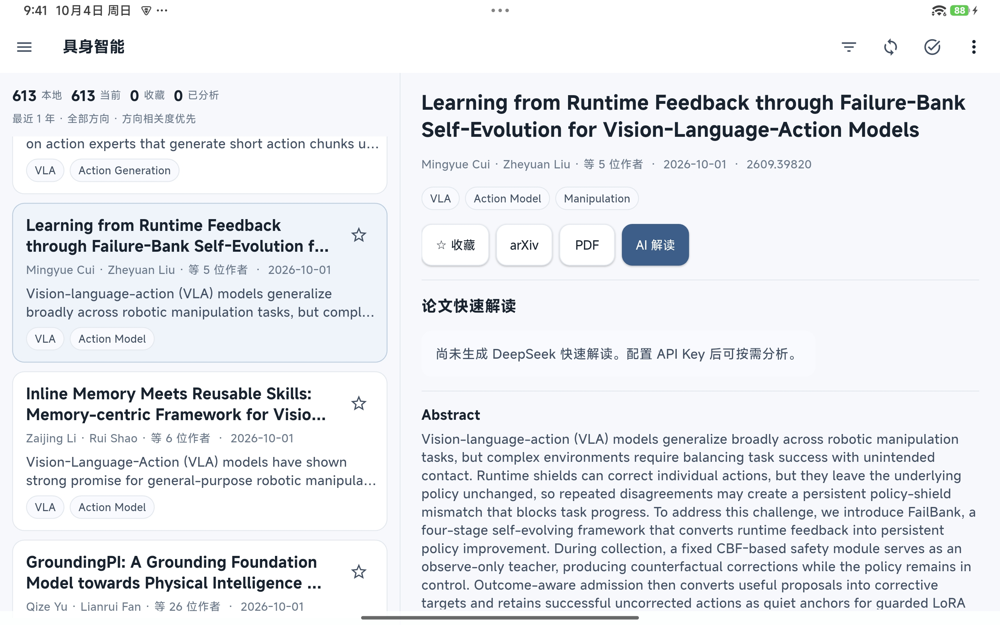

# 论文自动检索分析

<div align="center">

**AI Paper Auto Retrieval & Analysis**

面向研究人员的 Windows 桌面与 Android 平板论文工具：<br>
**自动检索 arXiv · 本地管理 · DeepSeek 快速解读 · 收藏筛选 · Excel / Markdown 导出**

<br>

[**⬇ 下载 Windows / Android**](https://github.com/yangkunpeng-coder/AI-Paper-Radar/releases)
&nbsp;&nbsp;·&nbsp;&nbsp;
[**▶ 平板操作演示**](https://github.com/yangkunpeng-coder/AI-Paper-Radar/releases/download/v1.2.0/AI-Paper-Radar-v1.1.0-demo_tablet.mp4)
&nbsp;&nbsp;·&nbsp;&nbsp;
[**📦 所有 Releases**](https://github.com/yangkunpeng-coder/AI-Paper-Radar/releases)

</div>

---

## 一分钟了解

这是一款用于 **自动发现、整理和快速理解 arXiv 论文** 的跨平台软件，可在 Windows 电脑和 Android 平板上使用。

当前支持三个研究领域：

- **具身智能**
- **智能体**
- **大语言模型**

软件将论文保存在本地 SQLite 数据库中，并可按时间、研究方向、收藏状态等条件筛选；如配置自己的 DeepSeek API Key，还可以直接生成论文快速解读。

> **v1.3.0 计划内容：** 新增独立 Android Phone UI，沿用 Tablet 与 Windows 入口。下载附件将在 v1.3.0 Release 发布后提供。

---

## 软件界面

### Windows 桌面



[▶ 查看 Windows 操作演示（v1.0.0）](https://github.com/yangkunpeng-coder/AI-Paper-Radar/releases/download/v1.0.0/AI-Paper-Radar-v1.0.0-demo.mp4)

### Android 平板



[▶ 查看 / 下载平板操作录屏](https://github.com/yangkunpeng-coder/AI-Paper-Radar/releases/download/v1.2.0/AI-Paper-Radar-v1.1.0-demo_tablet.mp4)

平板操作录屏仍引用历史 v1.2.0 Release 附件，文件名为 `AI-Paper-Radar-v1.1.0-demo_tablet.mp4`。如无法直接播放，请下载后观看。

---

## 核心功能

### 自动检索 arXiv

- 自动获取最新论文
- 支持三个独立研究领域
- 支持时间范围筛选
- 支持研究方向筛选
- 支持相关度 / 最新更新时间排序
- 本地保存同步结果，无需每次重新获取

### DeepSeek 论文快速解读

配置自己的 DeepSeek API Key 后，可以为论文生成结构化快速解读，包括：

- 一句话看懂
- 研究问题
- 方法
- 主要结果
- 主题标签

未配置 DeepSeek API Key 时，论文检索、浏览、收藏、筛选、排序和导出等功能仍可正常使用。

### 本地论文库

- SQLite 本地存储
- 收藏论文
- 作者及单位信息
- 原始摘要
- arXiv / PDF 快速打开
- 本地持久化保存

### 导出

支持将筛选结果导出为 **Excel** 和 **Markdown**。

---

## 下载与安装

目标发行版本：**v1.3.0**（待发布）

[**前往 v1.3.0 Release**](https://github.com/yangkunpeng-coder/AI-Paper-Radar/releases) · [查看已发布版本](https://github.com/yangkunpeng-coder/AI-Paper-Radar/releases)

v1.3.0 计划提供以下附件，实际文件名以 Release 的 **Assets** 列表为准：

| 平台 | 发行文件 | 使用方式 |
|---|---|---|
| Windows 64 位（Intel / AMD） | Windows ZIP 发行包 | 完整解压后，运行目录中的 EXE |
| Android 平板 | Android APK 安装包 | 下载到平板后安装 |

### Windows

1. 在 Release 的 **Assets** 中下载 Windows ZIP 发行包。
2. **完整解压**到一个文件夹，不要直接在压缩包中运行。
3. 双击解压目录中的 EXE 启动程序。

> 无需另行安装 Python 或 Flet。请保留 EXE 旁的 DLL、`data`、`Lib`、`site-packages` 等文件和目录，不要仅复制 EXE。v1.3.0 的 Windows 发行方式与 v1.0.0 的单文件 EXE 不同。

### Android 平板

1. 在 Release 的 **Assets** 中下载 APK。
2. 在平板上打开 APK，按系统提示允许当前浏览器或文件管理器安装应用。
3. 完成安装后，从桌面打开应用。

已有旧版应用时，建议先尝试覆盖安装，避免因卸载而丢失本地数据。

---

## 快速开始

1. 按上述步骤安装并启动对应平台版本。
2. 选择 **具身智能 / 智能体 / 大语言模型**。
3. 选择时间范围，点击 **同步** 获取论文。
4. 使用研究方向、收藏状态和排序条件筛选。
5. 点击论文查看详细信息，打开 arXiv 页面或 PDF。
6. 如需 AI 快速解读，在 **设置** 中填写自己的 DeepSeek API Key。
7. 按需收藏论文或导出 Excel / Markdown。

论文同步、PDF 下载与 AI 分析需要可用的网络连接。若当前日期没有匹配论文，可以扩大检索时间范围。

---

## DeepSeek API Key

DeepSeek 功能需要用户自行提供 API Key。

- 软件发行包**不包含**开发者 API Key。
- 用户 API Key 保存在本机。
- 不配置 API Key 不影响论文检索、浏览、收藏、筛选和导出。

---

## 软件演示

| 平台 | 演示 |
|---|---|
| Windows | [v1.0.0 完整操作演示](https://github.com/yangkunpeng-coder/AI-Paper-Radar/releases/download/v1.0.0/AI-Paper-Radar-v1.0.0-demo.mp4) |
| Android 平板 | [平板操作录屏](https://github.com/yangkunpeng-coder/AI-Paper-Radar/releases/download/v1.2.0/AI-Paper-Radar-v1.1.0-demo_tablet.mp4) |

演示可用于了解软件启动、研究领域切换、论文同步、筛选、论文详情和分析等使用流程。不同版本和平台的界面可能有所差异，请以实际安装版本为准。

---

## 系统要求

| 平台 | 要求 |
|---|---|
| Windows | Windows 10 / Windows 11，Intel / AMD 64 位系统 |
| Android | 支持安装发行 APK 的 Android 平板；具体系统版本与架构要求以 Release 说明为准 |

- 论文同步和 PDF 下载需要互联网连接。
- DeepSeek 分析需要互联网连接及用户自己的 DeepSeek API Key。
- 本地论文库、收藏和设置分别保存在各自设备上。

---

## 文件完整性校验

如 Release 附带 `SHA256SUMS.txt`，请使用**同一版本**的校验文件核对下载包。

Windows CMD 示例（将文件名替换为实际下载的 ZIP 或 APK）：

```cmd
certutil -hashfile "实际下载的文件名.zip" SHA256
certutil -hashfile "实际下载的文件名.apk" SHA256
```

输出应与该版本提供的 SHA256 一致。仓库中原有的 `SHA256SUMS.txt` 对应 v1.0.0，不能用于校验 v1.3.0 的新发行包。

---

## 数据与隐私

- 论文数据库保存在用户本机。
- 收藏、设置和分析结果保存在用户本机。
- 软件发行包不会预置用户私有数据。
- 软件发行包不会包含开发者 DeepSeek API Key。

---

## 当前源码

当前源码版本 **v1.3.1**（交互流畅性优化；尚未验证原生界面与发行构建）。SQLite schema v9、workflow revision 1.2.9 不变。

Python 源码包：`src/ai_paper_analyzer`，入口：`src/main.py`。旧数据库文件名、设置键与应用 ID 保留兼容。

Phone 已实现独立单列列表、论文详情、底部论文/收藏/任务/设置导航和筛选 Bottom Sheet；保留领域筛选与滚动状态，24 条 SQLite 渐进分页、卡片复用与深列表回收；共用移动服务、同步、DeepSeek、收藏和导出。PDF 使用可取消下载、单页渲染、缩放与退出清理。

保留上一轮 SQLite 连接关闭、同步评分去重、Desktop 局部更新与闲置代码清理。

历史演示视频仍指向已有 v1.2.0 附件。

## 版本记录

### v1.3.1（源码完成，本轮不发布）

- 收藏保存成功后立即更新图标，统计数量随后刷新。
- Phone 复用顶部控件，分页只追加新卡片；区分加载中、空结果与失败重试。
- Phone 内容加载与偏好保存并行，保存仍按顺序完成。
- Desktop 合并任务进度局部更新，保留开始/停止/完成即时反馈。
- Phone PDF 保留最多三页、8 MiB PNG 缓存，退出清空。

### v1.3.0（源码完成，待构建与真机验收）

- 新增 Phone 单列列表、独立详情、底部导航与触控筛选。
- 新增手机逐页 PDF 阅读、缩放、取消与清理。
- 手机与桌面、平板继续共用业务核心。

### v1.2.1（上一轮计划）

- 新增 Android APK，支持在平板上使用。
- 更新 Windows 64 位版本，采用完整目录 ZIP 发行包。
- 新增平板界面截图和操作录屏展示。

### v1.0.0

首个 Windows 正式公开版本，提供单文件 EXE 和 Windows 操作演示。

[查看 v1.0.0 Release](https://github.com/yangkunpeng-coder/AI-Paper-Radar/releases/tag/v1.0.0)

---

<div align="center">

[**下载 Windows / Android**](https://github.com/yangkunpeng-coder/AI-Paper-Radar/releases)
&nbsp;&nbsp;·&nbsp;&nbsp;
[**平板演示**](https://github.com/yangkunpeng-coder/AI-Paper-Radar/releases/download/v1.2.0/AI-Paper-Radar-v1.1.0-demo_tablet.mp4)
&nbsp;&nbsp;·&nbsp;&nbsp;
[**所有 Releases**](https://github.com/yangkunpeng-coder/AI-Paper-Radar/releases)

</div>
